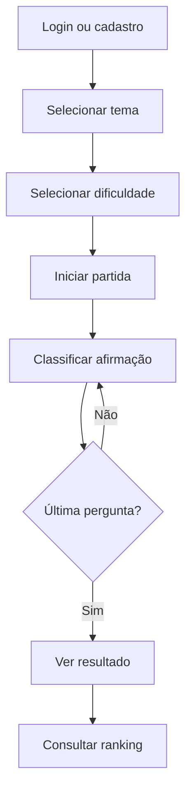

# Etapa 4 — Front-end React

## Componentes principais

| Componente/tela | Responsabilidade |
| --- | --- |
| `Header` | navegação, identificação do usuário e logout |
| `LoginPage` | autenticação e acesso à conta demonstrativa |
| `HomePage` | seleção de tema, dificuldade e retomada de partida |
| `GamePage` | pergunta atual, prazo, resposta e abandono |
| `Timer` | exibição regressiva baseada no prazo absoluto da API |
| `QuestionCard` | apresentação das duas alternativas permitidas |
| `ResultPage` | pontuação, precisão e revisão explicada |
| `RankingPage` | filtros e ordenação visual por pontos/tempo |
| `ProfilePage` | resumo pessoal e histórico de partidas |

## Fluxo da interface

## Decisões de integração

- O front-end não recebe a alternativa correta antes da resposta.
- A contagem usa `deadlineAt`, não apenas um contador local, reduzindo divergências após recarregamento ou latência.
- A API continua sendo a autoridade para correção, expiração e pontos.
- O access token fica em `sessionStorage`; o refresh token permanece no cookie HTTP-only criado pelo servidor.
- A simulação intercepta Axios e conserva o mesmo contrato de dados, permitindo trocar para a API real por variável de ambiente.

