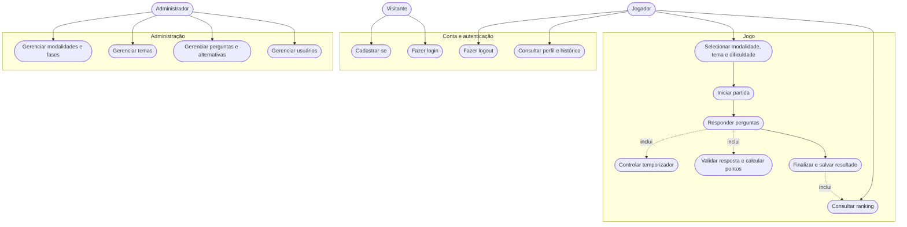

# Etapa 1 — Documentação e Planejamento

## Projeto: Quiz de Classificação de Requisitos

## 1. Visão geral

O sistema será uma aplicação web educativa em formato de quiz. O jogador deverá analisar uma afirmação relacionada aos temas **Pizzaria** ou **Hotel** e classificá-la usando somente uma das duas alternativas: **Funcional** ou **Não Funcional**.

O jogo terá três dificuldades — **Fácil, Médio e Difícil** —, temporizador por pergunta, pontuação calculada conforme dificuldade e tempo restante, histórico de partidas e ranking por modalidade. Um administrador poderá gerenciar usuários, modalidades, fases, temas, perguntas e alternativas.

### 1.1 Tecnologias definidas

| Camada | Tecnologia |
| --- | --- |
| Front-end | React + Vite + JavaScript |
| Back-end | Node.js + Express.js + JavaScript |
| ORM | Sequelize |
| Banco de dados | MySQL |
| Autenticação | JWT com token de acesso e renovação |
| Comunicação | API REST com JSON |
| Arquitetura | MVC, complementada por Services e Middlewares |

### 1.2 Aplicação do MVC

| Camada MVC | Responsabilidade no projeto |
| --- | --- |
| Model | Models do Sequelize, relacionamentos, validações e persistência no MySQL |
| View | Interface React: login, seleção, jogo, resultado, ranking e administração |
| Controller | Controllers do Express que recebem as requisições e devolvem respostas HTTP |
| Service, camada de apoio | Regras de autenticação, sorteio de perguntas, temporizador, pontuação e ranking |

## 2. Conceitos do domínio

- **Tema:** contexto das perguntas. O sistema começa com Pizzaria e Hotel.
- **Modalidade:** formato de uma partida. A modalidade inicial será **Clássica**, mas o CRUD permitirá criar outras modalidades futuramente.
- **Fase:** configuração pertencente a uma modalidade, contendo ordem, dificuldade, quantidade de perguntas e limite de tempo por pergunta.
- **Dificuldade:** nível Fácil, Médio ou Difícil atribuído à pergunta e à fase.
- **Pergunta:** afirmação que o jogador deverá classificar.
- **Alternativa:** uma das duas classificações permitidas: Funcional ou Não Funcional.
- **Partida:** tentativa iniciada por um jogador, com perguntas sorteadas, respostas, pontuação, tempo e estado.
- **Ranking:** classificação dos melhores resultados concluídos em cada modalidade.

## 3. Atores

| Ator | Descrição |
| --- | --- |
| Visitante | Pessoa ainda não autenticada. Pode criar uma conta e fazer login. |
| Jogador | Usuário autenticado. Pode configurar e jogar partidas, consultar resultados, histórico e ranking e fazer logout. |
| Administrador | Usuário autenticado com permissão administrativa. Pode realizar todas as ações do jogador e gerenciar usuários e o conteúdo do jogo. |

O temporizador, a validação das respostas, o cálculo dos pontos e a atualização do ranking são comportamentos internos do sistema, e não atores externos.

## 4. DDR — Documento de Requisitos

### 4.1 Requisitos Funcionais

| ID | Requisito funcional |
| --- | --- |
| RF-001 | O sistema deve permitir que um visitante crie uma conta informando nome, e-mail e senha. |
| RF-002 | O sistema deve impedir o cadastro de e-mails já utilizados. |
| RF-003 | O sistema deve permitir login com e-mail e senha válidos. |
| RF-004 | O sistema deve permitir logout e invalidar a sessão de renovação do usuário. |
| RF-005 | O sistema deve controlar o acesso por perfil, diferenciando Jogador e Administrador. |
| RF-006 | O jogador deve poder consultar seus dados, estatísticas, histórico de partidas e melhores resultados. |
| RF-007 | O administrador deve poder listar, pesquisar, ativar e desativar usuários, sem visualizar suas senhas. |
| RF-008 | O administrador deve poder criar, consultar, editar, ativar, desativar e arquivar temas. |
| RF-009 | O administrador deve poder criar, consultar, editar, ativar, desativar e arquivar modalidades. |
| RF-010 | O administrador deve poder criar, consultar, editar, ordenar, ativar, desativar e arquivar fases de uma modalidade. |
| RF-011 | Cada fase deve permitir configurar dificuldade, quantidade de perguntas, limite de tempo por pergunta e multiplicador de pontuação. |
| RF-012 | O administrador deve poder criar, consultar, editar, ativar, desativar e arquivar perguntas. |
| RF-013 | Toda pergunta deve ser associada a um tema, a uma dificuldade e a uma explicação da resposta correta. |
| RF-014 | O administrador deve poder gerenciar as alternativas de uma pergunta, respeitando apenas os tipos Funcional e Não Funcional. |
| RF-015 | O sistema deve validar que toda pergunta publicável possui exatamente duas alternativas ativas e apenas uma correta. |
| RF-016 | O sistema deve impedir a ativação de temas, fases ou modalidades que não possuam conteúdo suficiente e válido. |
| RF-017 | O sistema deve disponibilizar inicialmente os temas Pizzaria e Hotel, cada um com no mínimo 20 perguntas válidas. |
| RF-018 | O jogador deve poder selecionar uma modalidade, um tema e uma dificuldade/fase disponíveis. |
| RF-019 | Ao iniciar o jogo, o sistema deve criar uma partida vinculada ao jogador e registrar sua configuração. |
| RF-020 | O sistema deve sortear somente perguntas ativas que atendam ao tema e à dificuldade escolhidos. |
| RF-021 | O sistema não deve repetir perguntas dentro da mesma partida. |
| RF-022 | O jogo deve exibir uma pergunta por vez e somente as alternativas Funcional e Não Funcional. |
| RF-023 | O sistema deve iniciar um temporizador para cada pergunta conforme o limite configurado para a dificuldade/fase. |
| RF-024 | O jogador deve poder enviar somente uma resposta para cada pergunta e não poderá alterá-la depois da confirmação. |
| RF-025 | Quando o tempo terminar, o sistema deve encerrar automaticamente a pergunta e registrá-la como não respondida/incorreta. |
| RF-026 | Após cada resposta, o sistema deve informar se ela está correta e apresentar uma explicação breve. |
| RF-027 | O sistema deve calcular a pontuação da resposta no servidor considerando dificuldade, multiplicador e tempo restante. |
| RF-028 | O sistema deve registrar no servidor o tempo consumido em cada pergunta e o tempo total da partida. |
| RF-029 | Ao concluir a última pergunta, o sistema deve finalizar a partida e mostrar acertos, erros, percentual, pontuação e tempo total. |
| RF-030 | O sistema deve persistir a partida, as perguntas apresentadas e todas as respostas dadas. |
| RF-031 | O jogador deve poder abandonar uma partida; partidas abandonadas não participam do ranking. |
| RF-032 | Se a página for recarregada, o sistema deve recuperar uma partida ainda ativa e recalcular o tempo restante com base no horário do servidor. |
| RF-033 | O sistema deve permitir novas tentativas sem alterar resultados anteriores. |
| RF-034 | O sistema deve gerar ranking por modalidade e permitir filtros por tema e dificuldade. |
| RF-035 | O ranking deve ordenar os resultados por maior pontuação e usar o menor tempo como primeiro critério de desempate. |
| RF-036 | O ranking deve exibir apenas a melhor tentativa de cada jogador para a combinação de modalidade, tema e dificuldade selecionada. |
| RF-037 | O ranking deve apresentar posição, nome do jogador, pontuação, tempo e data da partida, com paginação. |
| RF-038 | O administrador deve poder pesquisar e filtrar modalidades, fases, temas, perguntas e usuários no painel administrativo. |
| RF-039 | O sistema deve preservar o histórico relacionado ao arquivar conteúdos já utilizados em partidas. |
| RF-040 | O sistema deve informar de maneira clara quando não houver perguntas suficientes para iniciar a configuração escolhida. |

> O temporizador e o ranking aparecem em requisitos funcionais porque o sistema precisa executá-los. Suas características de precisão, desempenho, integridade e segurança aparecem também como requisitos não funcionais.

### 4.2 Requisitos Não Funcionais

| ID | Requisito não funcional |
| --- | --- |
| RNF-001 | O front-end deve ser desenvolvido com React, Vite e JavaScript. |
| RNF-002 | O back-end deve ser desenvolvido com Node.js, Express.js, JavaScript e Sequelize, utilizando MySQL. |
| RNF-003 | A aplicação deve seguir MVC: React como View, controllers do Express como Controller e Sequelize/MySQL como Model. |
| RNF-004 | A API deve usar o padrão REST, dados em JSON e versionamento de rotas, iniciando por `/api/v1`. |
| RNF-005 | O temporizador deve usar o servidor como fonte oficial e apresentar diferença máxima de um segundo em relação ao tempo válido da pergunta. |
| RNF-006 | Os limites padrão devem ser 30 segundos no Fácil, 20 no Médio e 10 no Difícil, podendo ser alterados na configuração da fase. |
| RNF-007 | Pontuação, correção, tempo válido e posição no ranking devem ser calculados ou validados no servidor, nunca confiando em valores enviados pelo navegador. |
| RNF-008 | A atualização do ranking deve ficar disponível em até dois segundos após a conclusão bem-sucedida de uma partida. |
| RNF-009 | Em condições normais e com até 100 usuários simultâneos, 95% das consultas comuns da API devem responder em até dois segundos. |
| RNF-010 | O envio de uma resposta deve ser processado em até 500 ms em condições normais, sem considerar a latência da rede do usuário. |
| RNF-011 | As senhas devem ser armazenadas somente como hash seguro com salt, usando bcrypt ou algoritmo equivalente. |
| RNF-012 | A autenticação deve usar token de acesso de curta duração e mecanismo seguro de renovação revogável no logout. |
| RNF-013 | Rotas administrativas e dados de outros usuários devem ser protegidos por autenticação e autorização baseada em perfil. |
| RNF-014 | Entradas devem ser validadas e sanitizadas; consultas devem usar os mecanismos parametrizados do Sequelize para reduzir riscos de injeção. |
| RNF-015 | O login deve possuir limitação de tentativas, e a produção deve usar HTTPS, CORS restrito e segredos em variáveis de ambiente. |
| RNF-016 | A resposta correta não deve ser enviada ao front-end antes do envio ou encerramento da resposta do jogador. |
| RNF-017 | A interface deve ser responsiva e utilizável em telas a partir de 320 px de largura. |
| RNF-018 | O fluxo essencial deve ser operável por teclado e seguir contraste, rótulos e foco visível compatíveis com WCAG 2.1 nível AA. |
| RNF-019 | A aplicação deve funcionar nas duas versões estáveis mais recentes de Chrome, Edge e Firefox e na versão estável atual do Safari. |
| RNF-020 | A finalização da partida e a gravação do resultado/ranking devem ocorrer em transação para evitar dados parciais. |
| RNF-021 | Exclusões de registros que possuam histórico devem ser lógicas, mantendo a integridade referencial. |
| RNF-022 | Listagens administrativas e rankings devem usar paginação, com 20 itens por padrão e limite máximo de 100 por requisição. |
| RNF-023 | Datas devem ser armazenadas em UTC e convertidas para o fuso do usuário apenas na apresentação. |
| RNF-024 | O código deve ser modular, padronizado com ESLint e separado em Models, Controllers, Services, Routes, Middlewares e Validators. |
| RNF-025 | Os fluxos críticos de autenticação, resposta, pontuação e ranking devem possuir testes automatizados. |
| RNF-026 | A API deve registrar erros e eventos relevantes sem gravar senhas, tokens ou outras informações sensíveis nos logs. |
| RNF-027 | O sistema deve retornar mensagens de validação compreensíveis, mas não deve expor detalhes internos, consultas SQL ou rastros de pilha ao usuário. |
| RNF-028 | A aplicação deve coletar apenas os dados pessoais necessários e permitir a desativação da conta, em conformidade com os princípios da LGPD. |
| RNF-029 | O banco de produção deve possuir rotina de backup e procedimento testado de restauração. |

### 4.3 Regras de Negócio

| ID | Regra de negócio |
| --- | --- |
| RN-001 | Os temas iniciais obrigatórios são Pizzaria e Hotel. |
| RN-002 | Um tema só pode ser disponibilizado aos jogadores quando tiver pelo menos 20 perguntas ativas e válidas, distribuídas entre Fácil, Médio e Difícil. |
| RN-003 | Cada pergunta pertence a um único tema e a uma única dificuldade. |
| RN-004 | Cada pergunta possui exatamente duas alternativas: Funcional e Não Funcional, com apenas uma marcada como correta. |
| RN-005 | As dificuldades permitidas são somente Fácil, Médio e Difícil. |
| RN-006 | O temporizador é individual por pergunta. Os valores padrão são 30, 20 e 10 segundos, respectivamente, mas a fase pode sobrescrevê-los. |
| RN-007 | A modalidade inicial Clássica terá, por padrão, 10 perguntas aleatórias por partida. A quantidade é configurável e nunca pode superar o total disponível para o filtro escolhido. |
| RN-008 | Um jogador pode possuir apenas uma partida ativa. Ao confirmar uma nova partida, a anterior será marcada como abandonada. |
| RN-009 | Uma resposta confirmada é definitiva. Resposta incorreta, ausência de resposta ou tempo esgotado concede zero ponto. |
| RN-010 | Para uma resposta correta, a pontuação será `base + floor(base × tempoRestante ÷ tempoLimite)`, multiplicada pelo fator configurado na fase. |
| RN-011 | As bases padrão são 100 pontos no Fácil, 200 no Médio e 300 no Difícil. Assim, responder corretamente mais rápido gera bônus sem eliminar o peso da dificuldade. |
| RN-012 | O tempo total da partida é a soma do tempo efetivamente usado nas perguntas, limitado pelo tempo máximo de cada uma. |
| RN-013 | Somente partidas concluídas entram no ranking; partidas ativas, canceladas, abandonadas ou inválidas não entram. |
| RN-014 | No ranking, vence a maior pontuação; em empate, vence o menor tempo total; persistindo o empate, vence a partida concluída primeiro. |
| RN-015 | Cada jogador aparece uma vez em cada recorte do ranking, utilizando sua melhor tentativa. |
| RN-016 | Conteúdos usados em partidas não podem ser apagados fisicamente; devem ser arquivados para preservar o histórico. |
| RN-017 | O servidor registra o horário de início e o prazo de cada pergunta; manipulações do relógio do navegador não alteram o resultado. |
| RN-018 | O administrador pode alterar conteúdos futuros, mas a partida deve manter uma cópia dos dados essenciais apresentados ao jogador para preservar o resultado histórico. |

## 5. Casos de Uso em Mermaid.js



### 5.1 Resumo dos principais casos de uso

| Caso de uso | Ator principal | Pré-condição | Resultado esperado |
| --- | --- | --- | --- |
| UC-01 — Cadastrar-se | Visitante | E-mail ainda não cadastrado | Conta de Jogador criada |
| UC-02 — Fazer login | Visitante | Conta ativa e credenciais válidas | Sessão autenticada iniciada |
| UC-03 — Fazer logout | Jogador/Administrador | Usuário autenticado | Renovação da sessão revogada |
| UC-04 — Consultar perfil e histórico | Jogador | Usuário autenticado | Estatísticas e partidas do próprio usuário exibidas |
| UC-05 — Configurar partida | Jogador | Existirem modalidade, fase, tema e perguntas ativos | Configuração válida selecionada |
| UC-06 — Iniciar partida | Jogador | Configuração válida | Partida criada e perguntas sorteadas sem repetição |
| UC-07 — Responder perguntas | Jogador | Partida ativa e pergunta dentro do prazo | Resposta imutável registrada e feedback exibido |
| UC-08 — Controlar temporizador | Sistema | Pergunta iniciada | Prazo calculado pelo servidor e exibido pela View |
| UC-09 — Validar e pontuar | Sistema | Resposta recebida ou tempo esgotado | Correção, tempo e pontos registrados |
| UC-10 — Finalizar partida | Sistema | Última pergunta encerrada | Resultado persistido e elegível ao ranking |
| UC-11 — Consultar ranking | Jogador | Usuário autenticado | Ranking filtrado e paginado exibido |
| UC-12 a UC-14 — Gerenciar conteúdo | Administrador | Usuário autenticado com perfil ADMIN | Conteúdo criado, alterado, ativado ou arquivado com validação |
| UC-15 — Gerenciar usuários | Administrador | Usuário autenticado com perfil ADMIN | Usuários pesquisados, ativados ou desativados |

## 6. Estrutura de Pastas Planejada

```text
quiz-requisitos/
├── docs/
│   └── etapa-1-documentacao-planejamento.md
├── backend/
│   ├── src/
│   │   ├── config/
│   │   │   ├── database.js
│   │   │   └── env.js
│   │   ├── controllers/
│   │   │   ├── auth.controller.js
│   │   │   ├── user.controller.js
│   │   │   ├── theme.controller.js
│   │   │   ├── modality.controller.js
│   │   │   ├── phase.controller.js
│   │   │   ├── question.controller.js
│   │   │   ├── game.controller.js
│   │   │   └── ranking.controller.js
│   │   ├── models/
│   │   │   ├── index.js
│   │   │   ├── User.js
│   │   │   ├── RefreshToken.js
│   │   │   ├── Theme.js
│   │   │   ├── Modality.js
│   │   │   ├── Phase.js
│   │   │   ├── Question.js
│   │   │   ├── Alternative.js
│   │   │   ├── GameSession.js
│   │   │   ├── GameAnswer.js
│   │   │   └── Ranking.js
│   │   ├── services/
│   │   │   ├── auth.service.js
│   │   │   ├── game.service.js
│   │   │   ├── scoring.service.js
│   │   │   └── ranking.service.js
│   │   ├── middlewares/
│   │   │   ├── auth.middleware.js
│   │   │   ├── role.middleware.js
│   │   │   ├── error.middleware.js
│   │   │   └── rateLimit.middleware.js
│   │   ├── validators/
│   │   │   ├── auth.validator.js
│   │   │   ├── content.validator.js
│   │   │   └── game.validator.js
│   │   ├── routes/
│   │   │   ├── index.js
│   │   │   ├── auth.routes.js
│   │   │   ├── users.routes.js
│   │   │   ├── themes.routes.js
│   │   │   ├── modalities.routes.js
│   │   │   ├── phases.routes.js
│   │   │   ├── questions.routes.js
│   │   │   ├── games.routes.js
│   │   │   └── rankings.routes.js
│   │   ├── utils/
│   │   │   ├── ApiError.js
│   │   │   └── asyncHandler.js
│   │   ├── app.js
│   │   └── server.js
│   ├── migrations/
│   ├── seeders/
│   │   ├── themes.seed.js
│   │   ├── modalities-phases.seed.js
│   │   └── questions.seed.js
│   ├── tests/
│   │   ├── integration/
│   │   └── unit/
│   ├── .env.example
│   ├── .sequelizerc
│   └── package.json
├── frontend/
│   ├── public/
│   ├── src/
│   │   ├── api/
│   │   │   ├── axios.js
│   │   │   ├── auth.api.js
│   │   │   ├── game.api.js
│   │   │   ├── ranking.api.js
│   │   │   └── admin.api.js
│   │   ├── assets/
│   │   ├── components/
│   │   │   ├── common/
│   │   │   │   ├── Header.jsx
│   │   │   │   ├── Loading.jsx
│   │   │   │   └── ProtectedRoute.jsx
│   │   │   ├── game/
│   │   │   │   ├── Timer.jsx
│   │   │   │   ├── QuestionCard.jsx
│   │   │   │   ├── AnswerButton.jsx
│   │   │   │   └── ProgressBar.jsx
│   │   │   └── ranking/
│   │   │       └── RankingTable.jsx
│   │   ├── contexts/
│   │   │   └── AuthContext.jsx
│   │   ├── hooks/
│   │   │   ├── useAuth.js
│   │   │   └── useTimer.js
│   │   ├── layouts/
│   │   │   ├── MainLayout.jsx
│   │   │   └── AdminLayout.jsx
│   │   ├── pages/
│   │   │   ├── LoginPage.jsx
│   │   │   ├── RegisterPage.jsx
│   │   │   ├── HomePage.jsx
│   │   │   ├── GameSetupPage.jsx
│   │   │   ├── GamePage.jsx
│   │   │   ├── ResultPage.jsx
│   │   │   ├── RankingPage.jsx
│   │   │   ├── ProfilePage.jsx
│   │   │   └── admin/
│   │   │       ├── AdminDashboardPage.jsx
│   │   │       ├── ThemesPage.jsx
│   │   │       ├── ModalitiesPage.jsx
│   │   │       ├── PhasesPage.jsx
│   │   │       ├── QuestionsPage.jsx
│   │   │       └── UsersPage.jsx
│   │   ├── routes/
│   │   │   └── AppRoutes.jsx
│   │   ├── styles/
│   │   │   └── global.css
│   │   ├── utils/
│   │   │   ├── formatTime.js
│   │   │   └── storage.js
│   │   ├── App.jsx
│   │   └── main.jsx
│   ├── tests/
│   ├── .env.example
│   ├── index.html
│   ├── package.json
│   └── vite.config.js
├── .gitignore
└── README.md
```

## 7. Decisões para as próximas etapas

1. A modalidade inicial será **Clássica**, com 10 perguntas por partida; o modelo permitirá novas modalidades.
2. O tempo será controlado por pergunta e validado pelo back-end.
3. A pontuação será calculada no back-end, usando dificuldade e tempo restante.
4. O ranking exibirá a melhor tentativa de cada jogador em cada combinação de modalidade, tema e dificuldade.
5. Registros já relacionados a partidas serão arquivados, e não apagados fisicamente.
6. Na Etapa 2, os Models e relacionamentos deverão refletir todas essas regras, incluindo partidas e respostas para manter o histórico.
